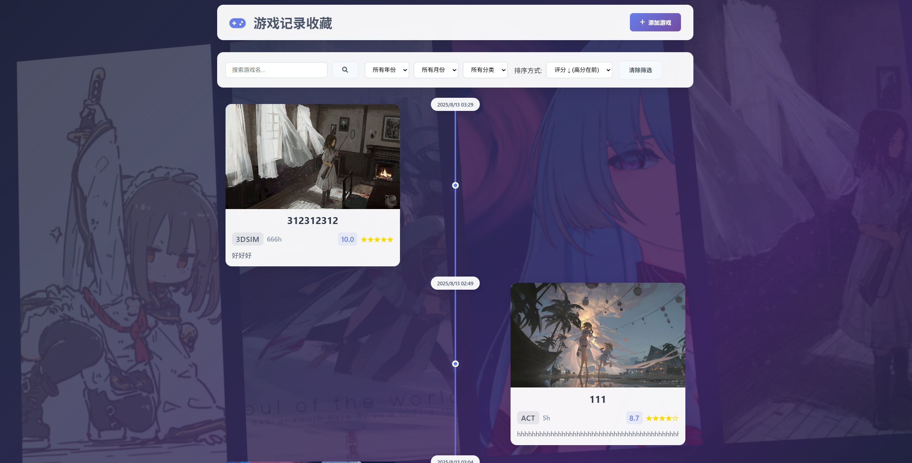

# 🎮 游戏记录收藏器
一个现代化的游戏收藏管理Web应用，具有精美的3D背景效果。
>【使用Electron构建的桌面应用版本】
[由于使用了Electron，应用体积会比较大，但好处是不用开终端了]

使用者请见`release`

## ✨ 功能特色
- **💾 本地存储**: 所有数据保存在本地`data`文件夹下，可移植
- **📝 游戏管理**: `添加、编辑和删除`游戏记录
- **⭐ 评分系统**: 0-10分评分，带星级显示
- **🏷️ 分类管理**: 可通过修改`config.json`,实现`自定义分类`
>【修改分类后，未在定义的分类中的数据会被自动归为“其他”但数据本身不做修改，可通过`编辑`修改分类后再保存】
- **🖼️ 封面图片**: 上传并展示游戏封面,支持`快速粘贴`
- **🔍 筛选**: 按名称、年份、月份、分类和评分搜索
- **📊 时间线视图**: 按时间顺序排列的精美卡片展示
- **🎨 动态背景**: 3D旋转网格，展示您的游戏封面
>[desktop版本数据路径 "GameCollector\resources\app\data"]
>[配置路径 "GameCollector\resources\app\config.json"]

## 🎯 背景系统

- **3D网格**: 4格旋转背景，带透视变换效果
- **智能轮换**: 防重复系统，避免重复显示相同封面
- **Steam风格**: 深紫蓝色渐变叠加层
- **流畅过渡**: 2.5秒淡入淡出，8-12秒轮换间隔

## 📱 响应式设计

- **桌面端**: 4列网格布局，完整功能
- **移动端**: 单列布局，优化界面
- **自适应**: 自动适配屏幕尺寸

## 🎨 主题定制

应用采用Steam风格的深色主题：

- 紫色和深蓝色渐变
- 60%透明度背景封面
- 流畅的3D变换和动画
- 专业的游戏美学风格

---

*为热爱游戏的玩家打造，记录和展示您的游戏历程。*
